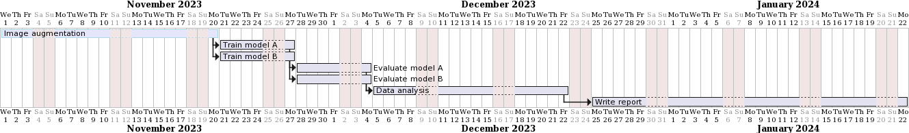

---
title: "Using image augmentation to improve vehicle detection in adverse weather conditions"
subtitle: "Research Proposal RMAI 2023"
author: "Alexander Van Hecke (852631385), Frederik Lefever (???)"
abstract: "Vehicle detection is an important aspect of traffic monitoring and surveillance.  Detection of vehicles can be done efficiently using the YOLOv8 model, however the classification of vehicles in images taken from traffic surveillance cameras can be difficult due to adverse weather conditions like snow, rain or fog.  The classification rate (mAP) can be improved by augmentation of the training data set.  Images of the training dataset are stochastically modified by an image augmentation pipeline adding adverse weather conditions.  This allows us to generate a larger training set, which in turn yields better results (TODO) "
institute: "OU"
date: \today
---
# Introduction

The YOLOv8 model can be used to detect a wide range of objects.  It was trained on a large dataset (ref) and is able to classify (ref) different categories.

It yields an xyz% accurarcy (ref) on the detection of vehicles.

we gaan ervan uit dat de detectie van vehicles op fotos met zeer slechte weersomstandigheden minder zal zijn.

een beproefde techniek om modellen robuuster te maken is om image augmentation toe te passen.  hierbij worden de trainings images door een pipeline van effecten gejaagd om ze stochastisch (dus random) aan te passen.  

in deze context willen we adverse weather effects toevoegen.  2 veronderstelde voordelen : 

- er is een minder grote dataset nodig om te trainen omdat je dezelfde images kan hergebruiken in normale en augmented vorm (1 of meerdere keren)
- de hypothese is dat het model dan beter kan generaliseren, omdat het door de "noise" moet kijken en dus meer de essentiele features van de te detecteren objecten (vehicles in ons geval) moet bepalen

# Literature review

zie zotero.  verwijzen naar : 

- image augmentation : voordelen ervan
- yolo algemeen
- yolo specifiek object detection
- eerder uitgevoerde onderzoeken naar image augmentation en de effecten ervan

# Research questions

wat vragen we ons af : 

- in welke mate wijzigt de accuracy van detectie van vehicles als we : 
  - geen augmentation doen op de trainingsset maar wel augmentation op de evaluatie of test set?
  - wel augmentation doen op de trainingsset en geen augmentation op de evaluatie set?
  - wel augmentation doen op de trainingsset en ook augmentation doen op de evaluatie set?

dit lijkt te verwijzen naar een "evaluating and acting" research question (LU4 p91).  Wat zijn de voor- en nadelen van het gebruik van augmented images?  Hoe effectief is het gebruik van augmented imags?

formuleren van een of meerdere hypotheses.  bv we veronderstellen dat modellen die getrained zijn met augmented images ook beter zullen werken voor het evalueren van augmented images.

opgelet : bij formuleren hypothese vermelden op welke manier we dit gaan evalueren / meten (bv accuracy, recall, precision, ...)
# Research methods

opzetten van volgende scenarios : 

- baseline : geen augmentation in training, geen augmentation in evaluatie
- slechtere evaluatie : geen augmentation in training, wel augmentation in evaluatie
- betere training : wel augmentation in training, geen augmentation in evaluatie
- betere training en evaluatie : wel augmentation in training, wel augmentation in evaluatie

telkens trainen van model, evaluatie doen, statistieken berekenen 
op het einde de 4 scenarios met elkaar vergelijken en zien wat de verschillen zijn

# Proposed time line

stappen detailleren, zie Figure \ref{timeline}.

# Bibliography

export van zotero
