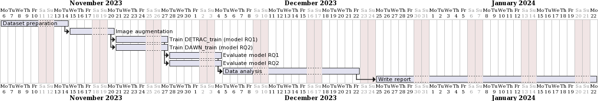

---
title: "Research proposal: Using image augmentation to improve vehicle detection in adverse weather conditions"
subtitle: "Research Proposal RMAI 2023"
author: 
- Alexander Van Hecke (852631385)
- Frederik Lefever (???)
abstract: "Vehicle detection is an important aspect of traffic monitoring and surveillance.  In this study we investigate whether the use of image augmentation can increase the detection of vehicles in adverse weather conditions.  The study will train two YOLOv8 models, one using augmented images and another using non augmented images.  The hypothesis that there is no difference in vehicle detection in adverse weather effects between the different models will be tested by comparing the mAP at 0.50 IoU, recall and precision of the models when validating against an adverse weather effects validation dataset"
institute: "Open University of The Netherlands"
date: \today
---
# Introduction

Het accuraat kunnen monitoren van de verkeersdrukte op autosnelwegen is van groot belang om verkeersstromen te kunnen sturen.  Wanneer grote drukte gedetecteerd wordt, kunnen deze data ter beschikking gesteld worden van leveranciers van navigatieproducten, die op hun beurt hun gebruikers kunnen waarschuwen om hun route aan te passen.

Op autosnelwegen zijn typisch op een aantal punten vaste camera's opgesteld die de verkeersstromen kunnen monitoren.  De beelden van deze camera's kunnen gebruik maken van object recognition om een telling te doen van het aantal voertuigen.  Ook bij slechte weersomstandigheden zoals regen, sneeuw en mist moeten deze tellingen accuraat kunnen gebeuren.

YOLOv8 maakt gebruik van een neural netwerk om objecten te herkennen.  Het doel is om dit netwerk zo generiek mogelijk te trainen, zodat het model zowel in goede als in slechte weersomstandigheden voertuigen kan herkennen.

In [2], [7] wordt het gebruik van image augmentation bij het trainen van het neural netwerk beschreven als een manier om het getrainde model beter te laten generaliseren.  Bij image augmentation worden wijzigingen aangebracht aan images.  Voorbeelden van wijzigingen die kunnen aangebracht worden zijn het roteren of croppen van images, het toevoegen van ruis op  foto's, het toevoegen van smear maar ook het artificieel introduceren van slechte weersomstandigheden zoals regen of mist.

Image augmentation kan op 2 manieren helpen bij het trainen van een neural network : 

- indien er slechts weinig bestanden beschikbaar zijn voor het trainen kan image augmentation gebruikt worden om het aantal bestanden te verhogen.  Elk trainingsbestand kan dan 1 of meerdere keren aangepast worden en in gewijzigde en niet-gewijzigde vorm aan het neurale network gevoed worden.
- voor het verbeteren van het generaliseren van het neuraal netwerk.  Doordat de trainingsbestanden meer ruis en onbelangrijke details bevatten dan wanneer deze niet zouden gewijzigd zijn, wordt het neural network gedwongen om enkel te focussen op de relevante details en de noise te filteren.  Dit kan leiden tot een betere accuracy in het herkennen van voertuigen in slechte weersomstandigheden.

# Literature review

Het YOLO framework [1] is een you-only-look-once model voor het detecteren van objecten in images.  Doordat de image maar eenmalig moet bekeken worden, laat het realtime object detection toe [5].

Het gebruik van image augmentation voor het trainen van deep learning modellen wordt beschreven in [2], [7], [16], [23].  In [10] wordt data augmentation ingezet bij het trainen van een Faster RCNN network om vehicle detection te verbeteren.  [6] bespreekt een aantal data augmentation technieken en motiveert het gebruik van image augmentation.

Het gebruik van het YOLO framework voor (real-time) vehicle detection wordt besproken in [5], [11], [12], [14], [15].  Het gebruik van YOLO en image augmentation voor het detecteren van voertuigen in adverse weather effects wordt besproken in [4], [8??], [12], [14], [17], [19??], [21]

-- VERWIJDEREN
zie zotero.  verwijzen naar : 

- image augmentation : voordelen ervan
- yolo algemeen
- yolo specifiek object detection
- eerder uitgevoerde onderzoeken naar image augmentation en de effecten ervan
-- EINDE VERWIJDEREN

# Research questions

In dit onderzoek willen we een model trainen dat in staat is om vehicles te detecteren in zowel goede als slechte weersomstandigheden.  Maw we willen dat het model voldoende generiek is zodat de weersomstandigheden een zo klein mogelijke rol spelen.

Concreet willen we kijken wat de voor- en nadelen van het gebruik van augmented images zijn voor het detecteren van voertuigen in images met adverse weather effects.  Verder willen we nagaan hoe effectief het gebruik van augmented images is.

RQ1 : Helpt image augmentation van trainingsbestanden om de accuracy te verhogen bij detectie van voertuigen in slechte weersomstandigheden?

We bekijken volgende scenarios : 

- trainen van een YOLO model voor het detecteren van vehicles met non-augmented images als trainingsset.  Dit model wordt gevalideerd tov images in slechte weersomstandigheden.
- trainen van een YOLO model voor het detecteren van vehicles met augmented images als trainingsset.  Dit model wordt gevalideerd tov images in slechte weersomstandigheden.

De images zullen augmented worden met een combinatie van augmentation techniques (artificiele regen/fog/..., smearing, rotatie??, cropping??)

We formuleren de volgende null hypothesis : er is geen verschil in mAP, recall en precision (???) bij het detecteren van vehicles tussen een YOLO model dat getraind werd met non-augmented images en een YOLO model dat getraind wordt met augmented images. 

-- VERWIJDEREN
wat vragen we ons af : 

- in welke mate wijzigt de accuracy van detectie van vehicles als we : 
  - geen augmentation doen op de trainingsset maar wel augmentation op de evaluatie of test set?
  - wel augmentation doen op de trainingsset en geen augmentation op de evaluatie set?
  - wel augmentation doen op de trainingsset en ook augmentation doen op de evaluatie set?

dit lijkt te verwijzen naar een "evaluating and acting" research question (LU4 p91).  Wat zijn de voor- en nadelen van het gebruik van augmented images?  Hoe effectief is het gebruik van augmented imags?

formuleren van een of meerdere hypotheses.  bv we veronderstellen dat modellen die getrained zijn met augmented images ook beter zullen werken voor het evalueren van augmented images.
-- EINDE VERWIJDEREN

# Research methods

uitleggen wat en hoe, welke image augmentations we gaan uitvoeren.  verder uitleggen per RQ wat we gaan meten.  spreken over t-tests, plots, ...  hoeft nog niet uitgevoerd te worden

## Design

Twee modellen zullen getrained worden, een niet-augmented model (model A) en een augmented model (model B).  Beide modellen zullen gevalideerd worden tov een dataset met adverse weather effect images.

In model A zullen we random X images selecteren uit de DETRAC dataset.  Deze bevat een mix van images maar de meeste zijn foto's overdag in goede weersomstandigheden.  Deze selectie zullen we gebruiken als trainingsset voor het trainen van een YOLOv8 model.  
TODO beschrijven welke andere hyperparameters we willen gebruiken?  of is dat in deze fase nog niet belangrijk?

In model B zullen we dezelfde images selecteren als in model A, maar bij sommige (in x% van de gevallen?) zullen we augmentations toevoegen.  TODO oplijsten exact welke augmentations.  Daarna wordt dit model gevalideerd tov dezelfde dataset

| dataset          | aantal images | bron   | augmentation | adverse weather |
|------------------|--------------:|--------|-------------:|----------------:|
| training model A |          2000 | DETRAC |           no |              no |
| training model B |          2000 | DETRAC |          yes |       simulated |
| validatie        |           500 | DAWN   |           no |             yes |

## Procedure

?? verschil met design?

## Data analysis

De data analyse zal gebeuren in python.  De focus zal liggen op visualisatie van de performantie van de verschillende modellen, alsook op statistische vergelijkingen (t-tests) om te bepalen of eventueel geobserveerde verschillen statistisch significant zijn.  In het bijzonder zullen volgende analyses gebeuren : 

RQ1 : berekenen van mAP at 0.50 IoU, precision en recall tussen model A en model B en t-tests zullen gebruikt worden om te bepalen of de eventueel geobserveerde verschillen statistisch significant zijn.

-- VERWIJDEREN
opzetten van volgende scenarios : 

- baseline : geen augmentation in training, geen augmentation in evaluatie
- slechtere evaluatie : geen augmentation in training, wel augmentation in evaluatie
- betere training : wel augmentation in training, geen augmentation in evaluatie
- betere training en evaluatie : wel augmentation in training, wel augmentation in evaluatie

telkens trainen van model, evaluatie doen, statistieken berekenen 
op het einde de 4 scenarios met elkaar vergelijken en zien wat de verschillen zijn
-- EINDE VERWIJDEREN

# Proposed time line

Eerst zal de nodige image augmentation van de trainingssets opgezet worden.  Daarna worden model A en model B getrained en vervolgens geevalueerd tov de validatieset.  De data analyse gebeurt dan op de evaluatieresultaten, waarna een raport zal geschreven worden (zie Figure \ref{timeline}).

# TODO
- zie proposal Frouke.  zij spreekt al meteen over de studie in abstract en ook de hypothese. zie ook opmerking over hoe gaan we juist evalueren?
- in het voorstel van Frouke (en in haar opmerkingen) is er geen aparte literature review sectie.  intro + literature review zitten in een Background sectie.
- misschien moeten we nog een paper of uitleg doen rond het meten van accuracy van YOLO modellen, bv wat is mAP, ...
- nadenken over hoe we juist gaan evalueren in onze null hypothesis.bij formuleren hypothese vermelden op welke manier we dit gaan evalueren / meten (bv accuracy, recall, precision, ...).  opgelet, het is niet juist om te spreken over mAP.  dit moet iets zijn als mAP at 0.50 IoU
- moet er een risk sectie opgenomen worden?  bv spreken over vinden van te weinig images, van te weinig images met adverse weather conditions
- wat is het verschil tussen detecteren en valideren?

# Bibliography

[1] J. Terven and D. Cordova-Esparza, “A Comprehensive Review of YOLO: From YOLOv1 and Beyond.” arXiv, Aug. 07, 2023. Accessed: Sep. 23, 2023. [Online]. Available: http://arxiv.org/abs/2304.00501

[2] M. Xu, S. Yoon, A. Fuentes, and D. S. Park, “A Comprehensive Survey of Image Augmentation Techniques for Deep Learning,” Pattern Recognition, vol. 137, p. 109347, May 2023, doi: 10.1016/j.patcog.2023.109347.

[3] T. Dao, A. Gu, A. Ratner, V. Smith, C. D. Sa, and C. Re, “A Kernel Theory of Modern Data Augmentation,” in Proceedings of the 36th International Conference on Machine Learning, PMLR, May 2019, pp. 1528–1537. Accessed: Oct. 26, 2023. [Online]. Available: https://proceedings.mlr.press/v97/dao19b.html

[4] Y. Miao, F. Liu, T. Hou, L. Liu, and Y. Liu, “A Nighttime Vehicle Detection Method Based on YOLO v3,” in 2020 Chinese Automation Congress (CAC), Nov. 2020, pp. 6617–6621. doi: 10.1109/CAC51589.2020.9326819.

[5] Z. Rahman, A. M. Ami, and M. A. Ullah, “A Real-Time Wrong-Way Vehicle Detection Based on YOLO and Centroid Tracking,” in 2020 IEEE Region 10 Symposium (TENSYMP), Jun. 2020, pp. 916–920. doi: 10.1109/TENSYMP50017.2020.9230463.

[6] C. Shorten and T. M. Khoshgoftaar, “A survey on Image Data Augmentation for Deep Learning,” J Big Data, vol. 6, no. 1, p. 60, Dec. 2019, doi: 10.1186/s40537-019-0197-0.

[7] M. D. Bloice, C. Stocker, and A. Holzinger, “Augmentor: An Image Augmentation Library for Machine Learning.” arXiv, Aug. 11, 2017. doi: 10.48550/arXiv.1708.04680.

[8] A. Lagorio, E. Grosso, and M. Tistarelli, “Automatic Detection of Adverse Weather Conditions in Traffic Scenes,” in 2008 IEEE Fifth International Conference on Advanced Video and Signal Based Surveillance, Sep. 2008, pp. 273–279. doi: 10.1109/AVSS.2008.50.

[9] Q. M. Chung, T. D. Le, T. V. Dang, N. D. Vo, T. V. Nguyen, and K. Nguyen, “Data Augmentation Analysis in Vehicle Detection from Aerial Videos,” in 2020 RIVF International Conference on Computing and Communication Technologies (RIVF), Oct. 2020, pp. 1–3. doi: 10.1109/RIVF48685.2020.9140740.

[10] R. A. Harianto, Y. M. Pranoto, and T. P. Gunawan, “Data Augmentation and Faster RCNN Improve Vehicle Detection and Recognition,” in 2021 3rd East Indonesia Conference on Computer and Information Technology (EIConCIT), Apr. 2021, pp. 128–133. doi: 10.1109/EIConCIT50028.2021.9431863.

[11] M. Maity, S. Banerjee, and S. Sinha Chaudhuri, “Faster R-CNN and YOLO based Vehicle detection: A Survey,” in 2021 5th International Conference on Computing Methodologies and Communication (ICCMC), Apr. 2021, pp. 1442–1447. doi: 10.1109/ICCMC51019.2021.9418274.

[12] V. Sowmya and R. Radha, “Heavy-Vehicle Detection Based on YOLOv4 featuring Data Augmentation and Transfer-Learning Techniques,” J. Phys.: Conf. Ser., vol. 1911, no. 1, p. 012029, May 2021, doi: 10.1088/1742-6596/1911/1/012029.

[13] N. Mo and L. Yan, “Improved Faster RCNN Based on Feature Amplification and Oversampling Data Augmentation for Oriented Vehicle Detection in Aerial Images,” Remote Sensing, vol. 12, no. 16, Art. no. 16, Jan. 2020, doi: 10.3390/rs12162558.

[14] D. Kumar and N. Muhammad, “Object Detection in Adverse Weather for Autonomous Driving through Data Merging and YOLOv8,” Sensors (Basel, Switzerland), vol. 23, no. 20, pp. 8471-, 2023, doi: 10.3390/s23208471.

[15] A. M. Ghoreyshi, A. AkhavanPour, and A. Bossaghzadeh, “Simultaneous Vehicle Detection and Classification Model based on Deep YOLO Networks,” in 2020 International Conference on Machine Vision and Image Processing (MVIP), Feb. 2020, pp. 1–6. doi: 10.1109/MVIP49855.2020.9116922.

[16] L. Perez and J. Wang, “The Effectiveness of Data Augmentation in Image Classification using Deep Learning.” arXiv, Dec. 13, 2017. doi: 10.48550/arXiv.1712.04621.

[17] M. Humayun, F. Ashfaq, N. Z. Jhanjhi, and M. K. Alsadun, “Traffic Management: Multi-Scale Vehicle Detection in Varying Weather Conditions Using YOLOv4 and Spatial Pyramid Pooling Network,” Electronics, vol. 11, no. 17, Art. no. 17, Jan. 2022, doi: 10.3390/electronics11172748.

[18] N. Al Mudawi et al., “Vehicle Detection and Classification via YOLOv8 and Deep Belief Network over Aerial Image Sequences,” Sustainability (Basel, Switzerland), vol. 15, no. 19, pp. 14597-, 2023, doi: 10.3390/su151914597.

[19] M. Hassaballah, M. A. Kenk, K. Muhammad, and S. Minaee, “Vehicle Detection and Tracking in Adverse Weather Using a Deep Learning Framework,” IEEE Transactions on Intelligent Transportation Systems, vol. 22, no. 7, pp. 4230–4242, Jul. 2021, doi: 10.1109/TITS.2020.3014013.

[20] M. A. Bin Zuraimi and F. H. Kamaru Zaman, “Vehicle Detection and Tracking using YOLO and DeepSORT,” in 2021 IEEE 11th IEEE Symposium on Computer Applications & Industrial Electronics (ISCAIE), Apr. 2021, pp. 23–29. doi: 10.1109/ISCAIE51753.2021.9431784.

[21] W. Li, “Vehicle detection in foggy weather based on an enhanced YOLO method,” J. Phys.: Conf. Ser., vol. 2284, no. 1, p. 012015, Jun. 2022, doi: 10.1088/1742-6596/2284/1/012015.

[22] A. Ansari, K. B. Khan, M. M. Akhtar, and H. Younis, “Vehicle Detection, Tracking and Counting on M4 Motorway Pakistan,” in Intelligent Technologies and Applications, I. S. Bajwa, F. Kamareddine, and A. Costa, Eds., in Communications in Computer and Information Science. Singapore: Springer, 2019, pp. 414–425. doi: 10.1007/978-981-13-6052-7_36.

[23] J. Pokrywka, “YOLO with High Dataset Augmentation for Vehicle Class and Orientation Detection,” in 2022 IEEE International Conference on Big Data (Big Data), Dec. 2022, pp. 6500–6506. doi: 10.1109/BigData55660.2022.10020576.

